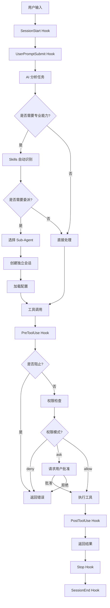

# CodeBuddy Code 产品架构与快速上手指南

## 目录
1. [产品概述](#产品概述)
2. [整体架构](#整体架构)
3. [核心模块详解](#核心模块详解)
4. [工作流程图](#工作流程图)
5. [快速上手](#快速上手)
6. [最佳实践](#最佳实践)

---

## 产品概述

### 什么是 CodeBuddy Code？

CodeBuddy Code 是一个 AI 驱动的智能编程助手，通过命令行界面(CLI)为开发者提供代码编写、分析、调试等全方位支持。它基于大语言模型（Claude），结合了强大的工具系统和安全机制。

### 核心特性

- **智能代码理解**：深度理解代码库结构和业务逻辑
- **自动化任务执行**：通过 AI 自动完成编码、测试、重构等任务
- **安全隔离**：沙箱环境保护系统安全
- **高度可扩展**：插件、Skills、Hooks 等多种扩展方式
- **团队协作**：支持项目级配置和团队共享

---

## 整体架构

### 架构分层

```
┌─────────────────────────────────────────────────────────────┐
│                      用户交互层                              │
│  CLI 命令行 / HTTP API / IDE 集成                           │
└────────────────────────┬────────────────────────────────────┘
                         │
┌────────────────────────┴────────────────────────────────────┐
│                   AI 核心引擎层                              │
│  ┌──────────────┐  ┌──────────────┐  ┌──────────────┐      │
│  │  模型管理    │  │  上下文管理  │  │  任务分析    │      │
│  └──────────────┘  └──────────────┘  └──────────────┘      │
└────────────────────────┬────────────────────────────────────┘
                         │
┌────────────────────────┴────────────────────────────────────┐
│                    能力扩展层                                │
│  ┌──────────┐ ┌──────────┐ ┌──────────┐ ┌──────────┐       │
│  │ Sub-     │ │ Skills   │ │ Slash    │ │ Plugins  │       │
│  │ Agents   │ │          │ │ Commands │ │          │       │
│  └──────────┘ └──────────┘ └──────────┘ └──────────┘       │
└────────────────────────┬────────────────────────────────────┘
                         │
┌────────────────────────┴────────────────────────────────────┐
│                    工具执行层                                │
│  ┌─────┐ ┌─────┐ ┌─────┐ ┌──────┐ ┌──────┐ ┌──────┐       │
│  │Read │ │Write│ │Edit │ │ Bash │ │ Grep │ │ Glob │       │
│  └─────┘ └─────┘ └─────┘ └──────┘ └──────┘ └──────┘       │
│  ┌──────────┐ ┌──────────┐ ┌──────────┐                   │
│  │WebFetch  │ │WebSearch │ │   Task   │                   │
│  └──────────┘ └──────────┘ └──────────┘                   │
└────────────────────────┬────────────────────────────────────┘
                         │
┌────────────────────────┴────────────────────────────────────┐
│                  集成与扩展层                                │
│  ┌──────────────┐  ┌──────────────┐  ┌──────────────┐      │
│  │ MCP 协议     │  │ Memory 系统  │  │ Hooks 系统   │      │
│  │ (外部工具)   │  │ (记忆管理)   │  │ (事件钩子)   │      │
│  └──────────────┘  └──────────────┘  └──────────────┘      │
└────────────────────────┬────────────────────────────────────┘
                         │
┌────────────────────────┴────────────────────────────────────┐
│                    安全与权限层                              │
│  ┌──────────────┐  ┌──────────────┐  ┌──────────────┐      │
│  │ 权限系统     │  │ 沙箱隔离     │  │ IAM 认证     │      │
│  └──────────────┘  └──────────────┘  └──────────────┘      │
└─────────────────────────────────────────────────────────────┘
```

---

## 核心模块详解

### 1. Sub-Agents 系统（子代理系统）

#### 功能定位
Sub-Agents 是专业化的 AI 助手，负责处理特定领域的任务。

#### 架构特点
```
主 Agent
  ├── 分析任务
  ├── 选择 Sub-agent
  └── 委派执行
       ├── code-reviewer (代码审查)
       ├── test-runner (测试运行)
       ├── refactoring-expert (重构专家)
       └── doc-writer (文档编写)
```

#### 核心组件
- **独立上下文**：每个 sub-agent 在隔离的上下文窗口中运行
- **专业工具集**：可配置特定的工具访问权限
- **权限控制**：支持不同的权限模式（default、acceptEdits、bypassPermissions、plan）
- **会话管理**：支持会话恢复和链式调用

#### 配置示例
```markdown
--- 
name: test-runner
description: 运行测试并修复失败的测试用例
tools: [Read, Bash, Write, Edit]
model: haiku
permissionMode: acceptEdits
---

你是一个专业的测试运行专家。执行以下任务：
1. 运行项目的测试套件
2. 分析失败的测试
3. 提供修复建议或自动修复
```

#### 工作流程
```
用户请求 → 主 Agent 分析 → 匹配 Sub-agent → 创建独立会话
    ↓
加载配置（工具、模型、权限）
    ↓
执行任务（在隔离上下文中）
    ↓
返回结果 + Agent ID
```

---

### 2. Skills 系统（技能系统）

#### 功能定位
Skills 是 AI 自动识别和调用的专业能力模块，对用户透明。

#### 与 Sub-Agents 的区别
| 维度 | Skills | Sub-Agents |
|------|--------|-----------|
| 调用方式 | AI 自动识别 | 显式委派 |
| 上下文 | 共享主上下文 | 独立上下文 |
| 复杂度 | 轻量级能力 | 复杂任务 |

#### 目录结构
```
.codebuddy/skills/          # 项目级（优先）
  └── data-analysis/
      └── SKILL.md
~/.codebuddy/skills/        # 用户级（全局）
  └── frontend-design/
      └── SKILL.md
```

#### Skill 定义
```markdown
---
name: data-analysis
description: 数据分析和可视化能力
allowed-tools: Read, Bash(python:*), Write
---

## 数据分析专家

当用户需要分析数据时，自动应用以下能力：
- 数据清洗和预处理
- 统计分析
- 可视化生成
```

---

### 3. MCP 集成（Model Context Protocol）

#### 架构设计
```
CodeBuddy Code (客户端)
    ↓
    ├─ STDIO ──→ 本地工具进程
    ├─ SSE ────→ 远程事件服务
    └─ HTTP ───→ HTTP 服务
```

#### 三种传输方式

**1. STDIO（标准输入输出）**
```json
{
  "type": "stdio",
  "command": "/path/to/tool",
  "args": ["arg1", "arg2"],
  "env": {"KEY": "value"}
}
```

**2. SSE（Server-Sent Events）**
```json
{
  "type": "sse",
  "url": "https://example.com/sse",
  "headers": {"Authorization": "Bearer token"}
}
```

**3. HTTP（HTTP 流式传输）**
```json
{
  "type": "http",
  "url": "https://example.com/mcp",
  "headers": {"X-API-Key": "key"}
}
```

#### 配置作用域

| 作用域 | 配置文件 | 优先级 | 应用范围 |
|--------|---------|--------|---------|
| local | `~/.codebuddy.json#/projects/` | 高 | 当前会话 |
| project | `<项目根>/.mcp.json` | 中 | 特定项目 |
| user | `~/.codebuddy.json` | 低 | 所有项目 |

#### 安全机制
- **项目作用域审批**：首次连接需用户批准
- **工具权限管理**：三级权限（deny、ask、allow）
- **OAuth 验证**：仅支持 http/https 协议

---

### 4. Memory 系统（记忆系统）

#### 分层架构
```
用户记忆 (~/.codebuddy/CODEBUDDY.md)     [优先级：最高]
  ├── 个人偏好
  ├── 全局配置
  └── 跨项目规则
      ↓
项目记忆 (./CODEBUDDY.md)                [优先级：次高]
  ├── 团队约定
  ├── 项目规范
  └── 导入的外部文档
      ↓
子目录记忆（延迟加载）                    [优先级：按需]
```

#### 记忆发现机制
```
工作原理：递归向上查找
当前目录：/home/user/project/foo/bar/

查找路径：
✓ /home/user/project/foo/bar/CODEBUDDY.md
✓ /home/user/project/foo/CODEBUDDY.md
✓ /home/user/project/CODEBUDDY.md
✗ /home/user/CODEBUDDY.md（到根目录为止）
```

#### 导入系统
```markdown
# CODEBUDDY.md
## CodeBuddy Added Memories

### 项目规范
@./docs/coding-standards.md
@./docs/architecture.md

### 个人偏好
@~/.codebuddy/my-preferences.md
```

**递归深度限制**：最大 5 跳

---

### 5. 安全与权限系统

#### 多层防御架构
```
┌─────────────────────────────────────┐
│ 第一层：基于权限的访问控制          │
│  - 默认只读                         │
│  - 显式授权                         │
└─────────────────┬───────────────────┘
                  │
┌─────────────────┴───────────────────┐
│ 第二层：沙箱隔离                    │
│  - 文件系统隔离                     │
│  - 网络隔离                         │
└─────────────────┬───────────────────┘
                  │
┌─────────────────┴───────────────────┐
│ 第三层：权限策略                    │
│  - deny（拒绝）                     │
│  - ask（询问）                      │
│  - allow（允许）                    │
└─────────────────┬───────────────────┘
                  │
┌─────────────────┴───────────────────┐
│ 第四层：IAM 认证                    │
│  - 凭据加密存储                     │
│  - 动态密钥获取                     │
└─────────────────────────────────────┘
```

#### 沙箱工作原理

**文件系统隔离**
```
默认访问权限：
├── 写入：当前工作目录及子目录
├── 读取：整个计算机（除拒绝目录）
└── 保护：~/.ssh、~/.bashrc、/bin 等
```

**网络隔离**
```
沙箱内进程 → 代理服务器 → 外部网络
              ├─ 域名白名单检查
              ├─ 用户确认请求
              └─ 流量记录
```

**平台实现**
- Linux: Bubblewrap 容器化
- macOS: Seatbelt 沙箱框架

---

### 6. Hooks 系统（钩子系统）

#### 事件生命周期
```
SessionStart → UserPromptSubmit → PreToolUse → PostToolUse → Stop → SessionEnd
    │               │                  │             │           │         │
    ↓               ↓                  ↓             ↓           ↓         ↓
  初始化          预处理            阻止检查       后处理      清理      归档
```

#### 核心事件

| 事件 | 触发时机 | 典型用途 |
|------|---------|---------|
| PreToolUse | 工具调用前 | 日志记录、权限检查、阻止操作 |
| PostToolUse | 工具调用后 | 自动格式化、验证、通知 |
| UserPromptSubmit | 用户提交后 | 输入预处理 |
| Notification | 发送通知时 | 自定义通知方式 |

#### 配置结构
```json
{
  "hooks": {
    "PreToolUse": [{
      "matcher": "Edit|Write",
      "hooks": [{
        "type": "command",
        "command": "jq -r '.tool_input.file_path' | python format.py"
      }]
    }]
  }
}
```

---

### 7. 插件系统

#### 插件架构
```
插件包
├── manifest.json         # 插件清单
├── commands/             # 斜杠命令
│   └── example.md
├── skills/               # Skills
│   └── SKILL.md
└── hooks/                # Hooks
    └── hooks.json
```

#### 插件市场类型
1. **本地目录市场**：从本地文件系统加载
2. **GitHub 市场**：从 GitHub 仓库获取
3. **HTTP 市场**：从 HTTP 服务器获取

#### 自动安装流程
```json
// .codebuddy/settings.json
{
  "extraKnownMarketplaces": {
    "team-plugins": {
      "source": {
        "source": "github",
        "repo": "org/team-plugins"
      }
    }
  },
  "enabledPlugins": {
    "plugin-a@team-plugins": true
  }
}
```

启动时自动：安装市场 → 安装插件 → 后台执行

---

## 工作流程图

### 完整请求处理流程



### Sub-Agent 调用流程

```
┌─────────────────────────────────────────┐
│          主 Agent 任务分析              │
└──────────────┬──────────────────────────┘
               │
    ┌──────────┴──────────┐
    │                     │
    ▼                     ▼
自动委派              显式调用
    │                     │
    └──────────┬──────────┘
               │
    ┌──────────┴──────────┐
    │  选择 Sub-Agent     │
    │  - 匹配 description │
    │  - 检查工具需求     │
    └──────────┬──────────┘
               │
    ┌──────────┴──────────┐
    │  创建独立会话       │
    │  - 加载配置         │
    │  - 设置权限         │
    │  - 初始化上下文     │
    └──────────┬──────────┘
               │
    ┌──────────┴──────────┐
    │  执行任务           │
    │  - 工具调用         │
    │  - 权限检查         │
    └──────────┬──────────┘
               │
    ┌──────────┴──────────┐
    │  返回结果           │
    │  - 任务输出         │
    │  - Agent ID         │
    └─────────────────────┘
```

---

## 快速上手

### 安装和基本使用

#### 1. 启动 CodeBuddy Code
```bash
# 基本启动
codebuddy

# 指定工作目录
codebuddy /path/to/project

# 非交互模式
codebuddy -p "分析这个项目的架构"
```

#### 2. 常用斜杠命令
```bash
/help          # 帮助信息
/memory        # 查看/编辑记忆
/init          # 初始化项目配置
/hooks         # 配置 Hooks
/plugin        # 管理插件
/permissions   # 查看权限设置
```

#### 3. 快速添加记忆
```bash
# 在对话中使用 # 符号
# 始终使用 TypeScript 编写代码

# 会弹出对话框选择保存位置
```

### 项目初始化最佳实践

#### Step 1: 创建项目记忆
```bash
codebuddy
> /init
```

生成的 `CODEBUDDY.md`:
```markdown
## CodeBuddy Added Memories

### 项目信息
- 项目名称: MyProject
- 技术栈: React + TypeScript + Node.js

### 开发规范
@./docs/coding-standards.md

### 常用命令
- 安装依赖: `npm install`
- 启动开发服务器: `npm run dev`
- 运行测试: `npm test`
- 构建生产版本: `npm run build`

### 架构说明
- 前端: src/frontend/ (React + TypeScript)
- 后端: src/backend/ (Node.js + Express)
- 数据库: PostgreSQL
```

#### Step 2: 配置团队插件
```json
// .codebuddy/settings.json
{
  "extraKnownMarketplaces": {
    "team": {
      "source": {
        "source": "github",
        "repo": "your-org/codebuddy-plugins"
      }
    }
  },
  "enabledPlugins": {
    "code-standards@team": true,
    "test-runner@team": true
  }
}
```

#### Step 3: 创建项目级 Sub-Agents
```bash
mkdir -p .codebuddy/agents/development
```

`.codebuddy/agents/development/test-runner.md`:
```markdown
---
name: test-runner
description: 运行项目测试并修复失败
tools: [Read, Bash, Write, Edit]
model: haiku
permissionMode: acceptEdits
---

你是测试专家。执行流程：
1. 运行 `npm test`
2. 分析失败测试
3. 自动修复或提供建议
```

#### Step 4: 配置沙箱和权限
```json
// .codebuddy/settings.json
{
  "sandbox": {
    "enabled": true,
    "autoAllowBashIfSandboxed": true,
    "excludedCommands": ["git", "docker"]
  },
  "permissions": {
    "allow": [
      "Read",
      "Edit(src/**/*.ts)",
      "Bash(npm:*)"
    ],
    "deny": [
      "Edit(**/*.env)",
      "Bash(rm:*)",
      "Bash(sudo:*)"
    ]
  }
}
```

---

## 最佳实践

### 1. 记忆管理

#### 用户记忆 vs 项目记忆
```markdown
# ~/.codebuddy/CODEBUDDY.md (用户记忆)
## CodeBuddy Added Memories

### 语言偏好
- 请始终使用中文回答

### 个人风格
- 喜欢详细的代码注释
- 倾向函数式编程

---

# ./CODEBUDDY.md (项目记忆)
## CodeBuddy Added Memories

### 团队规范
- 使用 2 空格缩进
- 遵循 Airbnb 风格指南

### 项目架构
@./docs/architecture.md
```

### 2. Sub-Agents 设计

#### 单一职责原则
```markdown
✅ 好的设计
- code-reviewer: 只负责代码审查
- test-runner: 只负责运行测试
- doc-writer: 只负责文档编写

❌ 不好的设计
- developer: 什么都做（职责不清晰）
```

#### 合理选择模型
```yaml
# 简单任务 → haiku（快速 + 省钱）
model: haiku
tools: [Bash]
description: 运行测试命令

# 复杂任务 → sonnet（平衡）
model: sonnet
tools: [Read, Write, Edit]
description: 代码重构

# 关键任务 → opus（高质量）
model: opus
tools: [Read, Edit]
description: 安全审查
```

### 3. 安全配置

#### 分层权限策略
```json
{
  "permissions": {
    "deny": [
      "Edit(**/*.env)",           // 保护敏感文件
      "Edit(package-lock.json)",  // 保护锁文件
      "Bash(rm:*)",               // 阻止删除命令
      "Bash(sudo:*)"              // 阻止 sudo
    ],
    "ask": [
      "Edit(package.json)",       // 依赖变更需确认
      "Bash(git:push)",           // 推送需确认
      "WebFetch"                  // 网络请求需确认
    ],
    "allow": [
      "Read",                     // 允许读取
      "Edit(src/**/*.ts)",        // 允许编辑源码
      "Bash(npm:test)",           // 允许测试
      "Bash(npm:build)"           // 允许构建
    ]
  }
}
```

### 4. MCP 集成

#### 配置示例
```bash
# 添加 GitHub MCP 服务器
codebuddy mcp add --scope user github \
  -- npx -y @modelcontextprotocol/server-github

# 配置权限
{
  "permissions": {
    "ask": ["mcp__github__create_issue"],
    "allow": ["mcp__github__get_issue"]
  }
}
```

### 5. Hooks 自动化

#### 代码格式化
```json
{
  "hooks": {
    "PostToolUse": [{
      "matcher": "Edit|Write",
      "hooks": [{
        "type": "command",
        "command": "jq -r '.tool_input.file_path' | { read file; [[ $file == *.ts ]] && npx prettier --write \"$file\"; exit 0; }"
      }]
    }]
  }
}
```

#### 命令审计
```json
{
  "hooks": {
    "PreToolUse": [{
      "matcher": "Bash",
      "hooks": [{
        "type": "command",
        "command": "jq -r '.tool_input.command' >> ~/.codebuddy/audit.log"
      }]
    }]
  }
}
```

---

## 常见使用场景

### 场景 1: 代码审查

```bash
# 方式 1: 自动委派
用户: "审查 src/auth.ts 的安全性"
→ AI 自动调用 code-reviewer sub-agent

# 方式 2: 显式调用
用户: "使用 code-reviewer 审查所有 API 端点"
→ 明确指定使用哪个 sub-agent
```

### 场景 2: 测试驱动开发

```bash
# 配置 test-runner sub-agent
.codebuddy/agents/test-runner.md

# 使用流程
1. 编写测试
2. "运行测试并修复失败"
3. sub-agent 自动执行并修复
```

### 场景 3: 文档生成

```bash
# 使用 doc-writer skill
用户: "为这个项目生成 API 文档"
→ AI 识别需求，自动应用 doc-writer skill
```

### 场景 4: 数据分析

```bash
# MCP 集成数据库
codebuddy mcp add db -- /path/to/db-tool

# 分析数据
用户: "分析用户表的活跃度趋势"
→ 调用 MCP 工具查询数据
→ 应用 data-analysis skill 生成报告
```

---

## 调试和故障排除

### 启用调试模式
```bash
codebuddy --debug
```

### 常见问题

#### 1. Sub-Agent 未被识别
```bash
# 检查清单
□ 文件位置正确？ (.codebuddy/agents/)
□ 文件扩展名是 .md？
□ YAML frontmatter 格式正确？
□ name 和 description 字段存在？
```

#### 2. 权限问题
```bash
# 查看当前权限
/permissions

# 检查配置
cat .codebuddy/settings.json | jq .permissions
```

#### 3. 沙箱问题
```bash
# 检查沙箱状态
codebuddy --debug

# 临时禁用沙箱（调试用）
{
  "sandbox": {
    "enabled": false
  }
}
```

---

## 总结

CodeBuddy Code 通过**分层架构**、**模块化设计**和**安全机制**，提供了一个强大而灵活的 AI 编程助手平台：

### 核心优势
1. **智能化**：AI 自动理解任务并选择合适的处理方式
2. **安全性**：多层防御保护系统和数据安全
3. **可扩展**：插件、Skills、Sub-Agents 等多种扩展机制
4. **团队协作**：项目级配置支持团队共享和标准化

### 推荐学习路径
1. 基础使用 → 了解基本命令和工作流程
2. 记忆系统 → 配置个人和项目记忆
3. Sub-Agents → 创建专业化任务处理器
4. 安全配置 → 设置权限和沙箱
5. 高级集成 → MCP、Hooks、Plugins

### 获取帮助
- 文档地图：https://cnb.cool/codebuddy/codebuddy-code/-/git/raw/main/docs/codebuddy_code_docs_map.md
- CLI 帮助：`/help` 或 `codebuddy --help`
- 问题反馈：https://cnb.cool/codebuddy/codebuddy-code/-/issues

祝你使用 CodeBuddy Code 愉快！🚀
