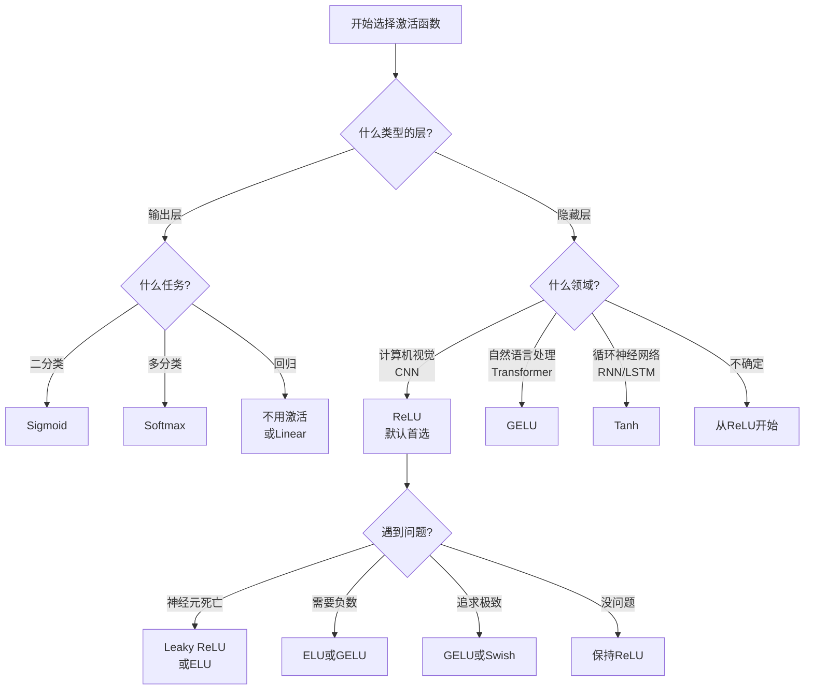

# 神经网络激活函数详解

## 副标题：让神经网络「活」起来的魔法开关

---

## 目录

1. [什么是激活函数?](#什么是激活函数)
2. [为什么需要激活函数?](#为什么需要激活函数)
3. [常见激活函数详解](#常见激活函数详解)
   - [Sigmoid - 温柔的压缩器](#sigmoid---温柔的压缩器)
   - [Tanh - 加强版Sigmoid](#tanh---加强版sigmoid)
   - [ReLU - 简单粗暴的剪刀](#relu---简单粗暴的剪刀)
   - [Leaky ReLU - 不那么绝情的剪刀](#leaky-relu---不那么绝情的剪刀)
   - [ELU - 更温和的处理负数](#elu---更温和的处理负数)
   - [GELU - 谷歌的新宠](#gelu---谷歌的新宠)
   - [Swish - 谷歌的另一个发现](#swish---谷歌的另一个发现)
   - [Softmax - 概率分配大师](#softmax---概率分配大师)
4. [如何选择激活函数?](#如何选择激活函数)
5. [激活函数速查表](#激活函数速查表)
6. [实际应用案例](#实际应用案例)
7. [总结](#总结)

---

## 什么是激活函数?

### 生活中的类比

想象你是一个门卫,站在大楼入口处。你的工作是决定:
- **谁可以进入大楼** (通过)
- **谁不能进入** (拦住)
- **或者只让一部分人进入** (部分通过)

**激活函数就是神经网络里的"门卫"**,它决定信息是否可以继续向前传递,以及以什么形式传递。

### 技术定义

在神经网络中,每个神经元会:
1. **接收输入信号** (来自上一层的数据)
2. **加权求和** (每个输入乘以权重,然后相加)
3. **通过激活函数** (对求和结果进行"调整")
4. **输出结果** (传递给下一层)

```
输入 → 加权求和 → 激活函数 → 输出
x    →  Wx + b   →   f(z)   →  y
```

**激活函数 f(z) 就是这个流程中的"调整"步骤**。

---

## 为什么需要激活函数?

### 问题1: 线性组合的局限性

假设没有激活函数,神经网络只是简单的线性运算:

```
第一层: y₁ = W₁x + b₁
第二层: y₂ = W₂y₁ + b₂ = W₂(W₁x + b₁) + b₂
```

**数学魔术**: 多层线性运算可以合并成一个线性运算!

```
y₂ = W₂W₁x + W₂b₁ + b₂ = W_新x + b_新
```

**结论**: 没有激活函数,无论堆叠多少层,神经网络都只是一个"复杂的线性函数"。

### 生活类比: 盖房子

- **只有线性函数** = 只能用直线搭建房子 → 只能盖平房
- **加上激活函数** = 可以用曲线搭建房子 → 可以盖各种形状的建筑

### 问题2: 现实世界是非线性的

现实中的问题往往不是简单的直线关系:

| 场景 | 问题类型 |
|------|---------|
| **图像识别** | 猫的形状是曲线的,不是直线 |
| **语音识别** | 声音是波形,不是直线 |
| **游戏AI** | 决策树是分支的,不是直线 |

**激活函数让神经网络能够学习这些复杂的曲线关系**。

---

## 常见激活函数详解

### Sigmoid - 温柔的压缩器

#### 📐 数学公式

```
σ(x) = 1 / (1 + e^(-x))
```

#### 🎨 函数图像

<p align="center">
  
</p>

*图1: Sigmoid函数将任意实数映射到(0,1)区间,呈现平滑的S形曲线。在x=0处输出0.5,远离0时趋向于0或1。*

#### 🧠 核心特点

1. **输出范围**: (0, 1) - 永远在0和1之间
2. **平滑曲线**: S形曲线,变化温柔
3. **中心点**: x=0时,输出0.5

#### 💡 直观理解

**类比: 考试成绩的转换器**

假设你的考试分数可以是任意值(可能是负数,也可能很大):
- 考得很差 (x = -100) → Sigmoid → 接近0分 (0.00001)
- 考得一般 (x = 0) → Sigmoid → 50分 (0.5)
- 考得很好 (x = 100) → Sigmoid → 接近100分 (0.99999)

**Sigmoid把任意范围的数字"压缩"到0-1之间**,就像把无限的成绩映射到0-100分的百分制。

#### 📊 输入输出示例

| 输入 x | Sigmoid(x) | 含义 |
|--------|------------|------|
| -10 | 0.00005 | 几乎是0 |
| -2 | 0.12 | 偏小 |
| 0 | 0.5 | 中间值 |
| 2 | 0.88 | 偏大 |
| 10 | 0.99995 | 几乎是1 |

#### ✅ 优点

1. **输出概率**: 输出像概率值(0到1),适合表示"是/否"
2. **平滑可导**: 曲线平滑,容易计算导数
3. **历史经典**: 早期神经网络的标准选择

#### ❌ 缺点

1. **梯度消失**: 当x很大或很小时,曲线变平,导数接近0
   - 想象爬山,山顶和山底都很平缓,不知道往哪走
   
2. **输出不以0为中心**: 输出都是正数(0到1)
   - 会导致训练时参数更新方向不够灵活

3. **计算慢**: 涉及指数运算e^(-x),比简单运算慢

#### 🎯 适用场景

- **二分类问题的输出层**: 判断"是/否"、"猫/狗"
- **需要概率输出**: 医疗诊断(患病概率)、信用评分

---

### Tanh - 加强版Sigmoid

#### 📐 数学公式

```
tanh(x) = (e^x - e^(-x)) / (e^x + e^(-x))
```

简化理解:
```
tanh(x) = 2 × sigmoid(2x) - 1
```

#### 🎨 函数图像

<p align="center">
  
</p>

*图2: Tanh函数输出范围为(-1,1),关于原点对称。在x=0处输出0,比Sigmoid更陡峭,适合作为隐藏层激活函数。*

#### 🧠 核心特点

1. **输出范围**: (-1, 1) - 在-1和1之间
2. **以0为中心**: x=0时,输出0
3. **更陡峭**: 比Sigmoid变化更快

#### 💡 直观理解

**类比: 温度的感受**

- 零下30度 (x = -5) → 很冷 (tanh ≈ -1)
- 0度 (x = 0) → 不冷不热 (tanh = 0)
- 30度 (x = 5) → 很热 (tanh ≈ 1)

**Tanh把数字映射到"负面(-1) ↔ 中性(0) ↔ 正面(1)"的区间**。

#### 📊 输入输出示例

| 输入 x | Tanh(x) | 含义 |
|--------|---------|------|
| -10 | -0.99999 | 强烈负面 |
| -2 | -0.96 | 负面 |
| 0 | 0.0 | 中性 |
| 2 | 0.96 | 正面 |
| 10 | 0.99999 | 强烈正面 |

#### ✅ 优点

1. **以0为中心**: 输出均匀分布在0两侧,训练更稳定
2. **比Sigmoid好**: 几乎所有方面都优于Sigmoid
3. **梯度更大**: 在0附近,导数更大(最大为1)

#### ❌ 缺点

1. **仍有梯度消失**: 当x很大或很小时,导数接近0
2. **计算慢**: 仍然需要指数运算

#### 🎯 适用场景

- **隐藏层的激活函数**: 比Sigmoid更适合中间层
- **RNN/LSTM的门控单元**: 控制信息流动

---

### ReLU - 简单粗暴的剪刀

#### 📐 数学公式

```
ReLU(x) = max(0, x) = {
    x,  如果 x > 0
    0,  如果 x ≤ 0
}
```

#### 🎨 函数图像

<p align="center">
  
</p>

*图3: ReLU函数在x>0时保持原值,x≤0时输出0。在x=0处有一个转折点,计算极其简单高效。*

#### 🧠 核心特点

1. **输出范围**: [0, ∞) - 0到正无穷
2. **简单**: 就是"小于0变0,大于0不变"
3. **非线性**: 虽然简单,但引入了非线性

#### 💡 直观理解

**类比: 单向闸门**

想象一个只能往一个方向流动的水管闸门:
- **正数(正向水流)**: 完全通过,保持原样
- **负数(反向水流)**: 完全阻断,输出0

**ReLU就像一把剪刀,把所有负数"咔嚓"剪掉,变成0**。

#### 📊 输入输出示例

| 输入 x | ReLU(x) | 解释 |
|--------|---------|------|
| -100 | 0 | 负数→0 |
| -1 | 0 | 负数→0 |
| 0 | 0 | 边界值 |
| 1 | 1 | 正数不变 |
| 100 | 100 | 正数不变 |

#### ✅ 优点

1. **计算超快**: 只需要一个比较和一个max操作
   ```python
   # 实现简单
   output = max(0, x)
   ```

2. **缓解梯度消失**: 正数区域梯度恒为1,信息可以畅通传递

3. **稀疏激活**: 大约50%的神经元会被"关闭"(输出0)
   - 类似大脑:不是所有神经元同时工作
   - 提高效率,减少过拟合

4. **收敛更快**: 训练速度比Sigmoid/Tanh快很多

#### ❌ 缺点

1. **Dead ReLU问题**: 
   - 如果神经元输出一直是负数,ReLU永远输出0
   - 这个神经元就"死掉"了,永远不会更新
   - **类比**: 水管完全堵住,永远不再流水

2. **输出不以0为中心**: 只有非负数输出

3. **输出无上界**: 可能输出非常大的数

#### 🎯 适用场景

- **CNN(卷积神经网络)**: 图像识别的标配
- **大多数深度网络的隐藏层**: 默认首选
- **需要快速训练的场景**: 计算资源有限时

#### 🔧 实际代码

```python
import numpy as np

def relu(x):
    return np.maximum(0, x)

# 示例
x = np.array([-2, -1, 0, 1, 2])
print(relu(x))  # 输出: [0 0 0 1 2]
```

---

### Leaky ReLU - 不那么绝情的剪刀

#### 📐 数学公式

```
Leaky ReLU(x) = {
    x,      如果 x > 0
    αx,     如果 x ≤ 0
}
```

通常 α = 0.01 (即负数乘以0.01)

#### 🎨 函数图像

<p align="center">
  
</p>

*图4: Leaky ReLU对负数保留小斜率(α=0.01),避免神经元死亡。注意左侧不是水平的,而是有一个小斜率。*

#### 🧠 核心特点

1. **输出范围**: (-∞, ∞) - 全范围
2. **负数有小斜率**: 负数不是变成0,而是乘以一个小系数α
3. **保留负数信息**: 给负数一条"生路"

#### 💡 直观理解

**类比: 给差生一点机会**

普通ReLU像严格的老师:
- "考试不及格? 一律记0分!"

Leaky ReLU像宽容的老师:
- "考试不及格? 给你10%的分数,不是完全没机会!"

**Leaky ReLU给负数一个"小活路",不是彻底归零**。

#### 📊 输入输出示例 (α = 0.01)

| 输入 x | ReLU(x) | Leaky ReLU(x) | 对比 |
|--------|---------|----------------|------|
| -100 | 0 | -1 | 保留了负数信息 |
| -10 | 0 | -0.1 | 保留了负数信息 |
| 0 | 0 | 0 | 相同 |
| 10 | 10 | 10 | 相同 |
| 100 | 100 | 100 | 相同 |

#### ✅ 优点

1. **解决Dead ReLU**: 负数神经元不会完全"死亡"
2. **计算仍然简单**: 只是多一个乘法
3. **保留更多信息**: 负数也有意义

#### ❌ 缺点

1. **需要调参**: α选多少? (通常0.01或0.001)
2. **理论不如ReLU完善**: 有时表现不一定更好

#### 🎯 适用场景

- **怀疑有Dead ReLU问题**: 网络训练不动时
- **对负数信息敏感的任务**: 某些特殊应用

#### 🔧 实际代码

```python
def leaky_relu(x, alpha=0.01):
    return np.where(x > 0, x, alpha * x)

# 示例
x = np.array([-2, -1, 0, 1, 2])
print(leaky_relu(x))  # 输出: [-0.02 -0.01  0.  1.  2.]
```

---

### ELU - 更温和的处理负数

#### 📐 数学公式

```
ELU(x) = {
    x,              如果 x > 0
    α(e^x - 1),     如果 x ≤ 0
}
```

通常 α = 1

#### 🎨 函数图像

<p align="center">
  
</p>

*图5: ELU在负数区域使用指数函数,更加平滑,有下界-α。比Leaky ReLU更温和,但计算成本略高。*

#### 🧠 核心特点

1. **输出范围**: (-α, ∞)
2. **负数部分平滑**: 使用指数函数,更平滑
3. **负数有下界**: 最小值是-α (通常是-1)

#### 💡 直观理解

**类比: 减速带**

- ReLU: 悬崖式阻断负数 (突然变0)
- Leaky ReLU: 给负数铺个小斜坡 (线性下降)
- ELU: 给负数设置减速带 (平滑曲线,有底线)

**ELU像一个"有底线的减速带",负数不会无限下降,最多到-α就停止**。

#### 📊 输入输出示例 (α = 1)

| 输入 x | ReLU(x) | Leaky ReLU(x) | ELU(x) |
|--------|---------|----------------|--------|
| -10 | 0 | -0.1 | -0.99995 |
| -2 | 0 | -0.02 | -0.86 |
| 0 | 0 | 0 | 0 |
| 2 | 2 | 2 | 2 |
| 10 | 10 | 10 | 10 |

#### ✅ 优点

1. **均值接近0**: 输出更接近0中心,训练更稳定
2. **更鲁棒**: 对噪声不那么敏感
3. **平滑**: 整个曲线都是平滑的

#### ❌ 缺点

1. **计算慢**: 负数部分需要计算e^x
2. **没有大幅提升**: 性能提升不明显,但计算变复杂

#### 🎯 适用场景

- **追求极致性能**: 愿意多花计算换一点准确率
- **研究实验**: 探索不同激活函数的效果

---

### GELU - 谷歌的新宠

#### 📐 数学公式

**精确公式** (理论版):
```
GELU(x) = x × Φ(x)
```
其中 Φ(x) 是标准正态分布的累积分布函数(CDF)

**近似公式** (实用版):
```
GELU(x) ≈ 0.5 × x × (1 + tanh[√(2/π) × (x + 0.044715x³)])
```

或者更简单的近似:
```
GELU(x) ≈ x × σ(1.702x)
```

#### 🎨 函数图像

<p align="center">
  
</p>

*图6: GELU是Transformer模型的标准激活函数,结合了概率门控机制。看起来像ReLU,但在0附近更平滑。*

#### 🧠 核心特点

1. **概率性激活**: 根据输入的"概率"来决定激活程度
2. **平滑非线性**: 整条曲线都是平滑的
3. **现代标准**: Transformer模型(如BERT、GPT)的默认选择

#### 💡 直观理解

**类比: 概率抽奖**

想象每个输入x都要参加一个抽奖:
- **x很大(正数)**: 中奖概率接近100% → 完全通过 (输出≈x)
- **x接近0**: 中奖概率50% → 部分通过 (输出≈0.5x)
- **x很小(负数)**: 中奖概率接近0% → 几乎阻断 (输出≈0)

**GELU根据输入的"好坏"概率性地决定是否让它通过**。

#### 🎓 深入理解: 为什么叫"Gaussian Error Linear Unit"?

**名字的由来**:
1. **Gaussian(高斯)**: 使用正态分布
2. **Error**: 考虑输入可能是"错误"或"噪声"的概率
3. **Linear Unit**: 线性单元(像ReLU)

**核心思想**:
```
GELU(x) = x × P(X ≤ x)
```
- `x`: 原始输入
- `P(X ≤ x)`: 标准正态分布下,随机变量X小于等于x的概率

**解释**:
如果x是一个"好"的输入(大于0),它被保留的概率就高;如果x是一个"坏"的输入(小于0),它被过滤掉的概率就高。

#### 📊 输入输出示例

| 输入 x | ReLU(x) | GELU(x) | 说明 |
|--------|---------|---------|------|
| -3 | 0 | -0.004 | 几乎为0 |
| -1 | 0 | -0.16 | 保留一点 |
| 0 | 0 | 0 | 相同 |
| 1 | 1 | 0.84 | 稍微小一点 |
| 3 | 3 | 3.00 | 几乎相同 |

#### ✅ 优点

1. **最先进**: 现代大模型(BERT、GPT)的标配
2. **性能好**: 在很多任务上超过ReLU
3. **理论优美**: 有良好的概率解释
4. **平滑可导**: 处处可导,梯度流动顺畅

#### ❌ 缺点

1. **计算复杂**: 比ReLU慢得多
2. **难以理解**: 公式比较复杂
3. **需要大模型**: 小网络可能体现不出优势

#### 🎯 适用场景

- **Transformer模型**: BERT、GPT、T5等
- **NLP任务**: 文本分类、问答、翻译
- **大规模深度网络**: 参数量很大的模型
- **追求最佳性能**: 计算资源充足,追求准确率

#### 🔧 实际代码

```python
import numpy as np
from scipy.special import erf

# 精确版本
def gelu_exact(x):
    return 0.5 * x * (1 + erf(x / np.sqrt(2)))

# 近似版本(更快)
def gelu_approx(x):
    return 0.5 * x * (1 + np.tanh(np.sqrt(2/np.pi) * (x + 0.044715 * x**3)))

# PyTorch实现
import torch
x = torch.tensor([-1.0, 0.0, 1.0])
output = torch.nn.functional.gelu(x)
print(output)  # tensor([-0.1588,  0.0000,  0.8413])
```

---

### Swish - 谷歌的另一个发现

#### 📐 数学公式

```
Swish(x) = x × sigmoid(βx)
```

当 β = 1 时:
```
Swish(x) = x × σ(x) = x / (1 + e^(-x))
```

#### 🎨 函数图像

<p align="center">
  
</p>

*图7: Swish函数自门控,在某些任务上性能优于ReLU。在负数部分比ReLU更平滑。*

#### 🧠 核心特点

1. **自门控**: 使用自己的sigmoid来控制自己
2. **平滑**: 整条曲线平滑
3. **可调节**: 参数β可以控制平滑程度

#### 💡 直观理解

**类比: 自我调节的音量旋钮**

- ReLU: 开关式 (要么全关,要么全开)
- Swish: 旋钮式 (根据输入大小平滑调节)

**Swish = 输入 × 输入自己的"信心分数"**

如果输入很大(很自信),sigmoid接近1,完全通过;
如果输入很小(不自信),sigmoid接近0,基本阻断。

#### 📊 输入输出示例

| 输入 x | ReLU(x) | Swish(x) | 说明 |
|--------|---------|----------|------|
| -3 | 0 | -0.14 | 允许小部分负数 |
| -1 | 0 | -0.27 | 保留更多负数 |
| 0 | 0 | 0 | 相同 |
| 1 | 1 | 0.73 | 稍微削弱 |
| 3 | 3 | 2.86 | 接近x |

#### ✅ 优点

1. **性能好**: 在某些任务上超过ReLU和GELU
2. **简单**: 公式比GELU简单
3. **平滑**: 处处可导

#### ❌ 缺点

1. **计算慢**: 需要计算sigmoid
2. **提升有限**: 不是所有任务都比ReLU好

#### 🎯 适用场景

- **移动端模型**: 如MobileNet
- **实验对比**: 尝试替代ReLU
- **追求平滑性**: 需要处处可导

#### 🔧 实际代码

```python
def swish(x, beta=1.0):
    return x * sigmoid(beta * x)

# PyTorch实现
import torch
x = torch.tensor([-1.0, 0.0, 1.0])
output = x * torch.sigmoid(x)
print(output)  # tensor([-0.2689,  0.0000,  0.7311])
```

---

### Softmax - 概率分配大师

#### 📐 数学公式

对于一组数 [x₁, x₂, ..., xₙ]:

```
Softmax(xᵢ) = e^(xᵢ) / Σⱼ e^(xⱼ)
```

#### 🧠 核心特点

1. **输出范围**: (0, 1) - 每个输出都是0到1之间
2. **概率分布**: 所有输出加起来等于1
3. **多分类**: 用于多个类别的概率分配

#### 💡 直观理解

**类比: 考试成绩转概率**

假设三个学生的考试分数:
- 小明: 90分
- 小红: 80分
- 小刚: 70分

**问题**: 谁最可能是第一名?

**Softmax的做法**:
1. 先放大差异: e^90, e^80, e^70
2. 归一化: 每个除以总和
3. 得到概率:
   - 小明: 66.5% (最可能是第一名)
   - 小红: 24.5%
   - 小刚: 9.0%

#### 📊 输入输出示例

**输入**: [2.0, 1.0, 0.1]

**计算过程**:
```
1. 计算指数:
   e^2.0 = 7.39
   e^1.0 = 2.72
   e^0.1 = 1.11
   
2. 求和:
   总和 = 7.39 + 2.72 + 1.11 = 11.22
   
3. 归一化:
   输出 = [7.39/11.22, 2.72/11.22, 1.11/11.22]
        = [0.659, 0.242, 0.099]
        
4. 验证:
   0.659 + 0.242 + 0.099 = 1.0 ✓
```

#### 🎨 Softmax可视化示例

<p align="center">
  
</p>

*图11: Softmax将logits转换为概率分布,所有输出和为1。左图显示原始输入值,右图显示转换后的概率分布。*

#### 🎯 Softmax vs Sigmoid

| 维度 | Sigmoid | Softmax |
|------|---------|---------|
| **用途** | 二分类 | 多分类 |
| **输出** | 一个概率值 | 多个概率值 |
| **和** | 不一定为1 | 一定为1 |
| **例子** | 是/否 | 猫/狗/鸟 |

#### ✅ 优点

1. **概率解释**: 输出可以直接当作概率
2. **凸显差异**: 放大最大值,压缩小值
3. **标准做法**: 多分类问题的标准输出层

#### ❌ 缺点

1. **计算慢**: 需要计算指数和求和
2. **数值稳定性**: e^x可能溢出(x太大时)

**解决方案**: Softmax的数值稳定版
```python
def stable_softmax(x):
    # 技巧: 先减去最大值,防止溢出
    x = x - np.max(x)
    exp_x = np.exp(x)
    return exp_x / np.sum(exp_x)
```

#### 🎯 适用场景

- **多分类输出层**: 图像分类(1000类)、文本分类
- **注意力机制**: Transformer中的注意力权重
- **概率分布**: 任何需要输出概率分布的场景

#### 🔧 实际代码

```python
import numpy as np

def softmax(x):
    # 数值稳定版本
    x = x - np.max(x)
    exp_x = np.exp(x)
    return exp_x / np.sum(exp_x)

# 示例: 三分类
logits = np.array([2.0, 1.0, 0.1])
probs = softmax(logits)
print(probs)  # [0.659 0.242 0.099]
print(np.sum(probs))  # 1.0

# PyTorch实现
import torch
x = torch.tensor([2.0, 1.0, 0.1])
output = torch.softmax(x, dim=0)
print(output)  # tensor([0.6590, 0.2424, 0.0986])
```

---

## 如何选择激活函数?

### 🎯 快速决策树



### 📋 按场景推荐

#### 1. 图像分类 (CNN)

**推荐顺序**:
1. **ReLU** (默认,99%的情况) ✅
   ```python
   model = nn.Sequential(
       nn.Conv2d(3, 64, 3),
       nn.ReLU(),  # 👈 默认选择
       nn.Conv2d(64, 128, 3),
       nn.ReLU(),
   )
   ```

2. **Leaky ReLU** (如果训练不稳定)
   ```python
   nn.LeakyReLU(negative_slope=0.01)
   ```

3. **ELU** (追求最佳性能,不在意速度)

#### 2. 自然语言处理 (Transformer)

**推荐**:
- **GELU** (BERT/GPT标配) ✅
  ```python
  # Transformer的Feed-Forward层
  nn.Linear(768, 3072),
  nn.GELU(),  # 👈 NLP首选
  nn.Linear(3072, 768)
  ```

#### 3. 循环神经网络 (RNN/LSTM)

**推荐**:
- **Tanh** (门控单元) ✅
- **Sigmoid** (门控开关)
  ```python
  # LSTM内部
  forget_gate = sigmoid(...)  # 控制遗忘
  input_gate = sigmoid(...)   # 控制输入
  output_gate = sigmoid(...)  # 控制输出
  cell_state = tanh(...)      # 候选值
  ```

#### 4. 输出层

| 任务类型 | 激活函数 | 例子 |
|---------|---------|------|
| **二分类** | Sigmoid | 垃圾邮件检测 |
| **多分类** | Softmax | 图像分类(1000类) |
| **多标签** | Sigmoid | 图像打标签(可能有多个) |
| **回归** | None或Linear | 房价预测 |

### 🧪 实验指南

**初学者**:
```
隐藏层: ReLU
输出层: 根据任务选择
```

**进阶者**:
```
1. 从ReLU开始
2. 如果训练不动 → 尝试Leaky ReLU或ELU
3. 如果追求SOTA → 尝试GELU或Swish
4. 对比实验,选最好的
```

**研究者**:
```
系统性对比:
- ReLU系列: ReLU, Leaky ReLU, PReLU, ELU
- 现代激活: GELU, Swish, Mish
- 根据任务和数据选择
```

---

## 激活函数速查表

### 📊 全面对比表

| 激活函数 | 公式简写 | 范围 | 优点 | 缺点 | 计算速度 | 使用场景 |
|---------|---------|------|------|------|---------|---------|
| **Sigmoid** | 1/(1+e^-x) | (0,1) | 输出像概率 | 梯度消失 | 慢 | 二分类输出 |
| **Tanh** | (e^x-e^-x)/(e^x+e^-x) | (-1,1) | 零中心 | 梯度消失 | 慢 | RNN隐藏层 |
| **ReLU** | max(0,x) | [0,∞) | 简单快速 | Dead神经元 | 最快 | CNN默认 ✅ |
| **Leaky ReLU** | max(0.01x,x) | (-∞,∞) | 无Dead问题 | 需要调α | 快 | ReLU问题时 |
| **ELU** | x或α(e^x-1) | (-α,∞) | 更鲁棒 | 计算慢 | 慢 | 追求性能 |
| **GELU** | x·Φ(x) | (-∞,∞) | SOTA性能 | 计算复杂 | 较慢 | Transformer ✅ |
| **Swish** | x·σ(x) | (-∞,∞) | 平滑 | 计算慢 | 较慢 | 移动端模型 |
| **Softmax** | e^xi/Σe^xj | (0,1) | 概率分布 | 计算慢 | 慢 | 多分类输出 ✅ |

### 🎨 可视化对比

#### 所有激活函数对比

<p align="center">
  
</p>

*图8: 主流激活函数的整体对比,可以看出不同函数的形状差异和特点。*

#### ReLU系列对比

<p align="center">
  
</p>

*图9: ReLU家族成员对比,展示对负数的不同处理方式 - ReLU直接截断,Leaky ReLU保留小斜率,ELU使用指数平滑。*

#### 现代激活函数对比

<p align="center">
  
</p>

*图10: ReLU vs GELU vs Swish,展示现代深度学习中的主流选择。GELU和Swish在0附近更平滑,在某些任务上性能优于ReLU。*

### 💡 记忆口诀

```
Sigmoid温柔挤,输出零到一
Tanh加强版,正负一之间
ReLU最简单,负数全归零
Leaky给活路,负数乘零点零一
GELU新时代,Transformer标配
Softmax概率王,多分类必备
```

---

## 实际应用案例

### 案例1: 手写数字识别 (MNIST)

**任务**: 识别0-9的手写数字

**网络结构**:
```python
import torch.nn as nn

class MNISTNet(nn.Module):
    def __init__(self):
        super().__init__()
        self.network = nn.Sequential(
            # 卷积层1
            nn.Conv2d(1, 32, 3),
            nn.ReLU(),              # 👈 隐藏层用ReLU
            nn.MaxPool2d(2),
            
            # 卷积层2
            nn.Conv2d(32, 64, 3),
            nn.ReLU(),              # 👈 隐藏层用ReLU
            nn.MaxPool2d(2),
            
            # 全连接层
            nn.Flatten(),
            nn.Linear(1600, 128),
            nn.ReLU(),              # 👈 隐藏层用ReLU
            
            nn.Linear(128, 10),
            # Softmax在训练时用CrossEntropyLoss自动处理
            # 推理时: nn.Softmax(dim=1)  # 👈 输出层用Softmax
        )
    
    def forward(self, x):
        return self.network(x)
```

**为什么这样选?**
- **ReLU (隐藏层)**: CNN默认选择,快速有效
- **Softmax (输出层)**: 10分类,需要概率分布

**训练结果**: 准确率 ~99%

---

### 案例2: 情感分析 (BERT)

**任务**: 判断电影评论是正面还是负面

**网络结构**:
```python
from transformers import BertModel
import torch.nn as nn

class SentimentClassifier(nn.Module):
    def __init__(self):
        super().__init__()
        self.bert = BertModel.from_pretrained('bert-base-uncased')
        
        # BERT内部使用GELU
        # 参考: BERT的Feed-Forward Network
        # nn.Linear(768, 3072)
        # nn.GELU()              # 👈 BERT内部用GELU
        # nn.Linear(3072, 768)
        
        # 分类头
        self.classifier = nn.Sequential(
            nn.Linear(768, 256),
            nn.ReLU(),            # 👈 这里可以用ReLU或GELU
            nn.Dropout(0.1),
            nn.Linear(256, 2),
            # nn.Softmax(dim=1)   # 👈 二分类输出
        )
    
    def forward(self, input_ids, attention_mask):
        outputs = self.bert(input_ids, attention_mask)
        pooled = outputs.pooler_output
        return self.classifier(pooled)
```

**为什么这样选?**
- **GELU (BERT内部)**: Transformer标准配置
- **ReLU (分类头)**: 简单任务,ReLU足够
- **Softmax (输出)**: 多分类输出

---

### 案例3: 图像风格迁移

**任务**: 把照片转换成梵高风格

**网络结构**:
```python
class StyleTransferNet(nn.Module):
    def __init__(self):
        super().__init__()
        
        # 编码器
        self.encoder = nn.Sequential(
            nn.Conv2d(3, 64, 3, padding=1),
            nn.ReLU(),              # 👈 主要用ReLU
            nn.Conv2d(64, 128, 3, padding=1),
            nn.ReLU(),
        )
        
        # 解码器
        self.decoder = nn.Sequential(
            nn.ConvTranspose2d(128, 64, 3, padding=1),
            nn.ReLU(),              # 👈 主要用ReLU
            nn.ConvTranspose2d(64, 3, 3, padding=1),
            nn.Tanh(),              # 👈 输出用Tanh!
        )
    
    def forward(self, x):
        encoded = self.encoder(x)
        decoded = self.decoder(encoded)
        return decoded
```

**为什么输出用Tanh?**
- **图像像素范围**: 通常归一化到[-1, 1]
- **Tanh输出范围**: 正好是(-1, 1)
- **完美匹配**: 不需要额外的后处理

---

### 案例4: 语音生成 (WaveNet)

**任务**: 生成自然的人声

**关键层**:
```python
class WaveNetLayer(nn.Module):
    def __init__(self):
        super().__init__()
        self.filter_conv = nn.Conv1d(128, 256, 2)
        self.gate_conv = nn.Conv1d(128, 256, 2)
        
    def forward(self, x):
        # Gated Activation
        filter_out = torch.tanh(self.filter_conv(x))    # 👈 Tanh
        gate_out = torch.sigmoid(self.gate_conv(x))     # 👈 Sigmoid
        
        return filter_out * gate_out  # 门控机制
```

**为什么这样组合?**
- **Tanh**: 生成候选值(可正可负)
- **Sigmoid**: 门控开关(0到1)
- **乘法**: 门控制候选值通过多少

这种组合在LSTM、GRU中也很常见!

---

### 案例5: 目标检测 (YOLO)

**任务**: 检测图片中的多个物体

**网络结构**:
```python
class YOLOv5(nn.Module):
    def __init__(self):
        super().__init__()
        
        # Backbone (特征提取)
        self.backbone = nn.Sequential(
            # 使用Swish/SiLU激活
            Conv(3, 64, 6, 2, 2),
            nn.SiLU(),              # 👈 Swish(也叫SiLU)
            Conv(64, 128, 3, 2),
            nn.SiLU(),
            # ... 更多层
        )
        
        # Detection Head
        self.head = nn.Sequential(
            nn.Conv2d(512, 256, 1),
            nn.SiLU(),
            nn.Conv2d(256, num_classes + 5, 1),
            # 最后分支:
            # - 类别: Sigmoid (多标签)
            # - 位置: 不用激活
            # - 置信度: Sigmoid
        )
```

**为什么用Swish?**
- **YOLOv5选择**: 实验发现Swish比ReLU好一点
- **平滑性**: 对小目标检测更友好
- **现代趋势**: 新模型尝试ReLU的替代品

---

## 总结

### 🎯 核心要点

1. **激活函数是必需的**
   - 没有激活函数 = 只能做线性变换
   - 激活函数引入非线性 = 可以学习复杂模式

2. **没有"最好"的激活函数**
   - 不同任务有不同需求
   - 需要根据场景选择
   - 实验对比是王道

3. **经验规则**
   ```
   默认选择: ReLU (快速、有效)
   如果不够好: 尝试其他变体
   追求极致: GELU或Swish
   输出层: 根据任务选择
   ```

### 📚 学习路径

**初学者**:
1. 理解ReLU、Sigmoid、Softmax
2. 知道隐藏层和输出层的区别
3. 能在自己的项目中正确使用

**进阶者**:
1. 理解梯度消失问题
2. 了解各种ReLU变体的动机
3. 能根据训练问题调整激活函数

**高级者**:
1. 理解GELU的概率解释
2. 能设计新的激活函数
3. 系统性评估不同激活函数

### 🔬 未来趋势

1. **自适应激活函数**
   - 参数化激活函数(如PReLU)
   - 根据数据自动调整

2. **搜索最优激活**
   - 使用神经架构搜索(NAS)
   - 为特定任务找最优激活

3. **新型激活函数**
   - Mish (2019): Swish的改进版
   - 更多变体不断涌现

### 💪 实践建议

1. **从默认开始**
   ```python
   # 大多数情况
   nn.ReLU()  # 隐藏层
   nn.Softmax(dim=1)  # 多分类输出
   ```

2. **遇到问题再调整**
   - 训练不收敛? → 检查激活函数
   - 梯度消失? → 换成ReLU或GELU
   - 精度不够? → 尝试GELU或Swish

3. **记录实验结果**
   ```
   实验1: ReLU - 准确率 92.3%
   实验2: Leaky ReLU - 准确率 92.1%
   实验3: GELU - 准确率 93.1% ✅
   结论: 使用GELU
   ```

### 🎓 延伸阅读

**经典论文**:
- ReLU: "Deep Sparse Rectifier Neural Networks" (2011)
- GELU: "Gaussian Error Linear Units" (2016)
- Swish: "Searching for Activation Functions" (2017)

**在线资源**:
- [CS231n激活函数讲解](http://cs231n.stanford.edu)
- [Distill.pub的可视化文章](https://distill.pub)

---

## 附录A: 激活函数及其导数

理解激活函数的导数对于掌握梯度传播至关重要。以下是各为激活函数及其导数的可视化对比。

### Sigmoid 函数及导数

<p align="center">
  
</p>

*图12: Sigmoid函数(左)和其导数(右)。注意导数最大值为0.25,这是梯度消失的根源。*

### Tanh 函数及导数

<p align="center">
  
</p>

*图13: Tanh函数(左)和其导数(右)。导数最大值为1,比Sigmoid更好,但仍有梯度消失问题。*

### ReLU 函数及导数

<p align="center">
  
</p>

*图14: ReLU函数(左)和其导数(右)。正数区域导数恒为1,梯度可以无损传递！*

### Leaky ReLU 函数及导数

<p align="center">
  
</p>

*图15: Leaky ReLU函数(左)和其导数(右)。负数区域导数为α(0.01),避免了Dead ReLU问题。*

### ELU 函数及导数

<p align="center">
  
</p>

*图16: ELU函数(左)和其导数(右)。负数区域导数平滑变化,更加鲁棒。*

### GELU 函数及导数

<p align="center">
  
</p>

*图17: GELU函数(左)和其导数(右)。处处可导,梯度流动顺畅,是Transformer的首选。*

### Swish 函数及导数

<p align="center">
  
</p>

*图18: Swish函数(左)和其导数(右)。自门控机制使其导数具有独特的形状。*

---

## 附录B: 数学推导 (可选阅读)

### Sigmoid的导数

```
σ(x) = 1 / (1 + e^(-x))

求导:
σ'(x) = σ(x) · (1 - σ(x))
```

**意义**: 导数最大值是0.25 (在x=0时),这就是为什么容易梯度消失。

### ReLU的导数

```
ReLU(x) = max(0, x)

导数:
ReLU'(x) = {
    1, 如果 x > 0
    0, 如果 x ≤ 0
}
```

**意义**: 正数区域导数恒为1,梯度可以无损传递!

### GELU的直觉

```
GELU(x) = x · Φ(x)
```

其中 Φ(x) 是标准正态分布的CDF:
```
Φ(x) = P(Z ≤ x), Z ~ N(0,1)
```

**解释**:
- 如果x很大,Φ(x)接近1 → GELU(x) ≈ x
- 如果x很小,Φ(x)接近0 → GELU(x) ≈ 0
- 如果x=0,Φ(0)=0.5 → GELU(0) = 0

---

## 快速参考卡片

### 隐藏层首选

```python
# 计算机视觉
nn.ReLU()

# 自然语言处理
nn.GELU()

# 循环神经网络
nn.Tanh()
```

### 输出层首选

```python
# 二分类
nn.Sigmoid()

# 多分类
nn.Softmax(dim=1)

# 多标签
nn.Sigmoid()  # 每个标签独立

# 回归
None  # 不用激活函数
```

### 故障排除

| 问题 | 可能原因 | 解决方案 |
|------|---------|---------|
| 训练不收敛 | 梯度消失 | 换成ReLU |
| 部分神经元死亡 | Dead ReLU | 换成Leaky ReLU |
| 想要更高精度 | ReLU太简单 | 试试GELU |
| 训练太慢 | 激活函数复杂 | 换回ReLU |

---

**恭喜你!** 🎉 现在你已经掌握了神经网络激活函数的核心知识!

记住:**实践是最好的老师**。在自己的项目中尝试不同的激活函数,观察效果,积累经验,你会越来越熟练!

---

**文档版本**: v1.0  
**最后更新**: 2024年  
**适合人群**: 高中生及以上,深度学习初学者  
**预计阅读时间**: 45-60分钟
